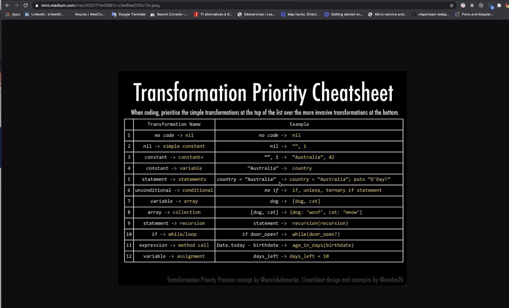
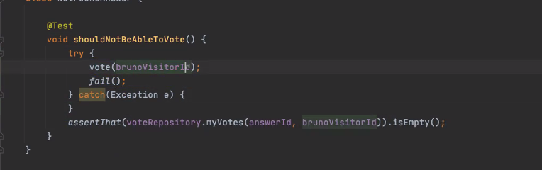

# Formation TDD et Clean Architecture dans le monde Java

[](https://github.com/marc-bouvier/tdd-clean-architecture-java/actions)
[](https://sonarcloud.io/dashboard?id=marc-bouvier_tdd-clean-architecture-java)
[](https://sonarcloud.io/dashboard?id=marc-bouvier_tdd-clean-architecture-java)

2020-12-09 - 2020-12-10

[Formation TDD et Clean Architecture dans le monde Java](https://wealcomecompany.com/wealcome-java-tdd-clean-architecture-formation)

Ressources conseillées

- [Ports & adapters architecture](https://herbertograca.com/2017/09/14/ports-adapters-architecture/)  
- [Ian Cooper: TDD, where did it all go wrong](https://vimeo.com/68375232) 
- [Wealcome - Blog](https://wealcomecompany.com/blog/)
    - [Pourquoi le TDD est-il si indispensable pour vos projets ?](https://wealcomecompany.com/blog/pourquoi-tdd-indispensable-dans-vos-projets-wealcome)
    - [Quel est le véritable lien entre BDD et TDD ?](https://wealcomecompany.com/blog/bdd-tdd-lien-michael-azerhad-wealcome)
    - ["On fait du TDD chez nous", on vous ment, attention !](https://wealcomecompany.com/blog/tdd-on-vous-ment-michael-azerhad-wealcome)
    - [Conférence sur BDD, DDD, ATDD et TDD par Michaël AZERHAD](https://wealcomecompany.com/blog/bdd-ddd-atdd-tdd-michael-azerhad-wealcome)
    - [TDD ne ralentit pas, au contraire on va plus vite !](https://wealcomecompany.com/blog/tdd-video-demonstration-conway-michael-azerhad-wealcome)
    - [Démonstration complète de BDD, ATDD et TDD avec Java](https://wealcomecompany.com/blog/bdd-tdd-full-java-demo-michael-azerhad-wealcome)
    - [Démonstration la plus connue de TDD avec Java et en français](https://wealcomecompany.com/blog/tdd-d%C3%A9monstration-video-fizzbuzz-michael-azerhad-wealcome)
    
   
## Contexte pour moi

On commence à être dépassé par le foncionnel qui devient complexe.
Et là, les tests d'intégration flaky et les foules de mock nous bloquent.

- Perte de la conaissance métier


## Ce que TDD peut apporter

### 1. La sur-confiance dud éveloppeur

Livraisons qui ne sont pas maitrisées.

Il ya  toujours des surprises une fois que c'est joué en prod.

> Ca marche sur ma machine

C'est non professionnel. Faute d'inattention.

### 2. La lenteur pour trouver des bons algos

Ex. énormément de temps passé 
- Try and error dans le browser
- Temps passé dans le débugger

Etude Société générale

Quotdien d'un dev

Il passe 6 min par jour à écrire du code.

### 3. Du code mort inaccessible à foison

En vrais sur des grosses méthodes
- du code défensif qui n'a pas lieu d'etre
- du code qui n'a plus lieu d'être

Dans tous les projets où il n'y  pas de discipline

On a tres peur de corriger ca et on blionde de d"éfense notre code

-> Devient tres vite illisilbe et on passe de plus en plus de temps à lire du code.

### 4. Peur de toucher au code existant

Peur de casser..

Ex. Tech lead :" ne touchez pas au copde qui concerne pas le ticket"
->> workaround

> Le workaround prime sur la guérison


On régresse. Et il y a jamais d'amliration .
On touche pas au code des autres.
Pas de propriété collective du code

### 5. Perte de la connaissance métier

OUI !

On aimerait que l'intention reste.

On ne veut pas toucher aux commentaires des autres

### Ne pas s'étonner

- si les dlais explosent
- anormalient qu aumenent
conde imcoprehensible
- promesses non tenues aux clients
- **Devs songent deja à changer de mission** pour malheureusement reproduire 

## Comment éviter tous ces problèlmes?

Code review. Souvent baclées. Pas suffisant. C'est une activité humaine.

Nommage des choses : classes, méthodes variables.

Pouvoir lire le code comme une histoire.

Il peut y avoir des commentaires utiles. 
ex. Raisons pour lesquelles on a du faire un workaround( pourquoi on a fait un choix inattendu)

> Extract till you drop 

Extraire les méthodes jusqu'à ce qu'on ne puisse plus le faire.

> Ce te force à bien nommer les choses et a refactorer le code.

Petites méthodes single responsibility. Les méthodes deviennent **composables**.

Respecter l'ordre de lecture.

> Une fonction doit faire **Une seule chose**

SRP. 

## Définition de TDD

> Se **faire guider** dans les algos

Faire bien du premier coup -> je passe moins de temps.

TDD c'est ton point de sauvegarde contre les interruptions.

TODO : citation des slides "Qu'est ce que TDD"?

Le problème de TDD dans l'esprit des gens. Dommage le mot "Test".

On veut être **guidés**. TDD nous permet de nous **laisser porter** par des feedback courts qui nous permettent de 
rectifier notre trajectoire quand on fait fausse route. et dès qu'on a fini.

> C'est bcp plus noble d'enlever que rajouter des choses.

## Définition de test unitaire

Tester un comportement (le quoi)
- ex. calculer la moyenne générale des éléève sur 4 années

Différent de tester le comment (on peut le faire mais on efface le test après)
    - ex. tester que la somme est bien faite (détail d'implémentation)
    - ex. tester la fonction moyenne

> Je n'ai pas de framework de mock!
-> La tentation de faire mal

[](https://miro.medium.com/max/1020/1*tw0QBYz-LSwBnaiCD0c7iA.jpeg)
https://blog.cleancoder.com/uncle-bob/2013/05/27/TheTransformationPriorityPremise.html
https://medium.com/@zolipeto/extract-of-uncle-bobs-transformation-priority-premise-post-85ab20216fb1
[Transformation Priority Premise - NDC conf 2011 Uncle bob](https://www.youtube.com/watch?v=B93QezwTQpI&feature=youtu.be&t=187)

## Attention cucumber

Si ton client n'est pas impliqué, tu te tires une balle dans le pied...

Le plus dur avec BDD c'est que tout est distribué partout.
World object devient très vite compliqué et couplé.

Ian cooper. 

> Le TDD, c'est du BBD quand c'est bien fait

Le BDD c'est un test qui est avancé. 
Et puis tu as une suite de tests unitaires en boucle TDD.
Le dernier test de la suite est le test du scénario (le test d'acceptation)

En formulant ton gherkin, tu peux apporter "le perfectionnisme de l'user story".

Il vaut mieux s'en servir comme un outil pour aller vers des conversations avec le métier.

Le gherkin est la source de confiance. Le code doit refléter ça.

https://news.ycombinator.com/item?id=10194242

Dans la réunion avec le métier (ex 20min). Tu le challenge régulièrement.

Le gherkin va synthétiser la conversation et les exemple.
Attention le gherkin doit pouvoir etre converti en code.

Et là on peut avancer avec la double boucle TDD.

Le scénario BDD sert à tester que l'on fait le bon code (ce qui est attendu)
Les test TDD servent à test qu'on l'on fait du code juste (qualité, craft)

## Attention

On ne doit pas tester du code deja ecrit
On peut le commenter et on le ré-écrit en TDD;

TDD tout comme mutation testing (ex. pitest) est un détecteur de mensonge de ton code.

> "Mode cerise"

Une implem : une vraie, une fausse

Le backend mocké

Ici tdd te dit que ton code est pas testable.

Ici le mode cerise il expliue la clean archi.

## Test unitaire lent

Un test unitaire lent n'est pas unitaire

## Clean architecture

- REndre les **logiques d'orchetration** testables.
- Ne pas dépendre de technos sous-jascentes
- Remettre à plus tard des choix techniques lourds
    - Pouvoir faire des POC

### Adapters primaires

Ceux qui interrogent les use-case
- Spring boot controler, CLI (console), Event subscriber

### Adapters Secondaires

S comme en sortie

### Use case interactor

### Presenters

## Les types de tests

- Acceptation +unitaires (fusionnés)
    - milliseconde
- Test Intégration : tests en réel
    - Mauvaise définition : test qui passe plusieurs classes
        - La vraie base en local par ex
        - pb test qui test 2 choses (logique métier et infra)
    - Bien : le test il ne teste que dans l'adapter
        - Je teste que les requêtes SQL sont correctes
        - Beaucoup moins de tests d'intégration à faire
        - Possibilité de les lancer dans un autre processus (ou une autre suite ou processus)
        
- Tests end to end
    - IL test "en paranoia"
        - Si ta configuration est bien ficelée (Spring boot conf)
        - Formatage du Json en retour
            - Cas OK
            - Cas Erreur (ex. 400) 

> TDD c'est du pair-programming avec ton ordinateur

> Il y a une manie d'appeler Test Unitaire ce qui n'en est pas


# Mode mirroring

package de test qui correspond au package de prod.

On s'oblige à casser la symmétrie entre les packages de test et de prod.

Ainsi on est obligé d'utiliser les API publiques.

# Nested tests

- permet de classifier les tests
    - des noms plus courts
    - une hierarchie des setUp
        - quand tu as un before global
        - tu peux initialiser des trucs supplémentaires que quand un test nested en a besoin
    - peut être fold dans l'IDE
    
    
## Comment est gérée la concurrence pour un vote dans stackoverflow?

Ils utilisent une BDD graphe, un vote c'est une relation vers une question.


## Transactions

Comment mettre en valeur la transaction.

Pourquoi ne pas encapsuler la transaction dans le save du repo?

Si une exception arrive à la suite de l'appel du repo (dans le use case par ex.)

Donc l'ensemble du handle doit gérer une transaction.

Ex. Programmatic transaction de Spring.

Comment enforcer le fait de devoir utiliser une transaction dans un usecase.

## Appliquer TDD sur du legacy

J'essaye de réécrire le code de zéro en TDD.


## Ajouter l'infrastructire dans la clean architecture

Une question avec plusieurs réponses. et le nombre de votes. 

- Lister les questions et les réponses
- Pouvoir voter pour différentes réponses


Package "write"
Package "read" (pas forcément le meme modèle que l'écriture)
- Ici on peut se permettre de combiner les aggrégats (il n'y a pas de pb de concurrence)

Read et write ont chacun un hexagone différent. Ils peuvent potentiellement ^être sur des
processus différents.

Heuristique quand on commence à écrire un nom de test "shouldNotReadAnyPAge**IfPageDoesNotExists**"
Ca indique qu'on devrait introduire une nested class

```java
@Nested class
NotExistingPages {
    @Test
    void shouldNotReadAnyPage(){
    }
}
```

https://www.baeldung.com/spring-programmatic-transaction-management

Tout ce qui appele le use case c'est un adapter primaire
Tout ce qui est appelé par le use case c'est un adapter secondaire

ReadPage aura la responsabilité de disre si tu as accès ou pas à la donnée etc...

Qui fait le lien entre le InMemoryRepository et le InMemoryQuery

Mettre en commun les ids. Quand on a un vote, on va pouvoir lister les votes.

2 Inmemory 
- un expres pour les tests  `InMemoryPageQueryStub`
- un pour la prod  `InMemoryPageQuery` où on fait le vrai lien entre la lecture et l'écriture par ex.

Easy exception  test



Presenter : adapte le retour du service à ce qu'on veut à l'écran.


- UUID générés depuis le front.
- Switch implem à chaud
- Lire le livre rouge
- Presenter
    - Le service va prendre en paramètre un presenter

Autres questions. On garde contact.

Poser des questions je peux (event sourcing, CQRS)

